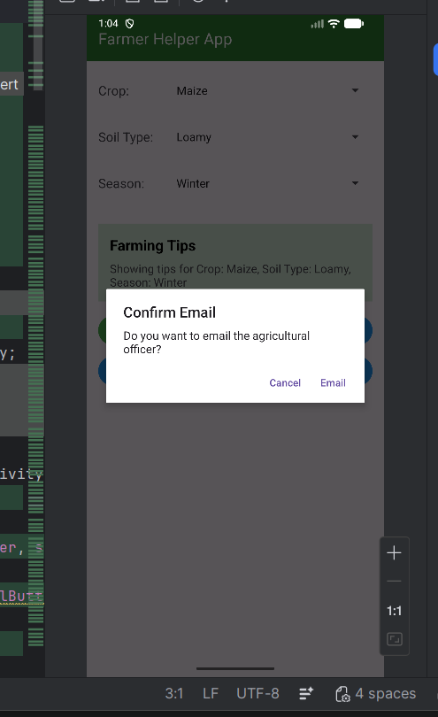

# 🌾 Farmer Helper App – Android Studio Project

## 📖 About the Project
The Farmer Helper App is an Android application developed using Android Studio to support farmers with basic crop-related information and easy communication with agricultural experts. This app helps farmers select crop details and receive simple guidance based on their selections.

The application provides a user-friendly interface where farmers can choose crop type, soil type, and season. Based on the selection, the app displays useful crop guidance or tips. It also allows farmers to easily contact an agriculture officer or expert through call, SMS, or email with confirmation dialogs for safety.

This project demonstrates the implementation of fundamental Android concepts and real-time communication features.

---

## 🚀 Features
- Select crop type using Spinner
- Select soil type using Spinner
- Select season using Spinner
- Display crop guidance and tips
- Navigation between activities using Intent
- Call agriculture expert option
- Send SMS option
- Send Email option
- Confirmation DialogBox before calling or sending messages
- Simple and user-friendly interface

---

## 🛠 Technologies Used
- Java
- XML Layout Design
- Android Studio
- Activities and Intents
- Spinner
- TextView
- Button
- AlertDialog (Confirmation Dialog)
- Implicit Intents (Call, SMS, Email)

---

## 📂 Project Structure
- Java Files: `app/src/main/java`
- XML Layout Files: `app/src/main/res/layout`
- AndroidManifest.xml: `app/src/main`

---

## 🎯 Expected Output
- Screen to select crop, soil, and season
- Button to view crop guidance
- Screen displaying crop tips and information
- Buttons to Call Expert, Send SMS, and Send Email
- Confirmation dialog before telephony actions

---

## 💡 Learning Outcome
This project helps in understanding:
- Spinner usage in Android
- Activity navigation using Intents
- Passing data between activities
- Displaying dynamic information
- Using implicit intents for call, SMS, and email
- Creating confirmation dialog boxes
- Designing simple farmer-friendly UI

---

## 👩‍💻 Developed By
Register Number: 732923ITR051

## 📸 App Screenshot

